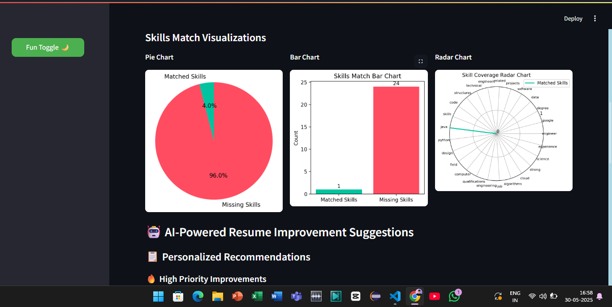

# 📄 Smart Resume Analyzer

**Smart Resume Analyzer** is a Streamlit-based web app that intelligently analyzes student resumes and compares them with job descriptions using **NLP**, **ML**, and **GPT-powered feedback** — perfect for campus placements and hackathons.

## 🚀 Features
- 📄 **PDF Resume & JD Parsing**
- 📊 **Cosine Similarity-Based Match Score**
- 🧠 **Skill Extraction & Comparison**
- 📈 **Pie Chart of Matched vs Missing Skills**
- 🤖 **GPT Suggestions to Improve Resume**
- ⚡ **Responsive and Sleek Streamlit UI**

## 📷 Screenshots

  

